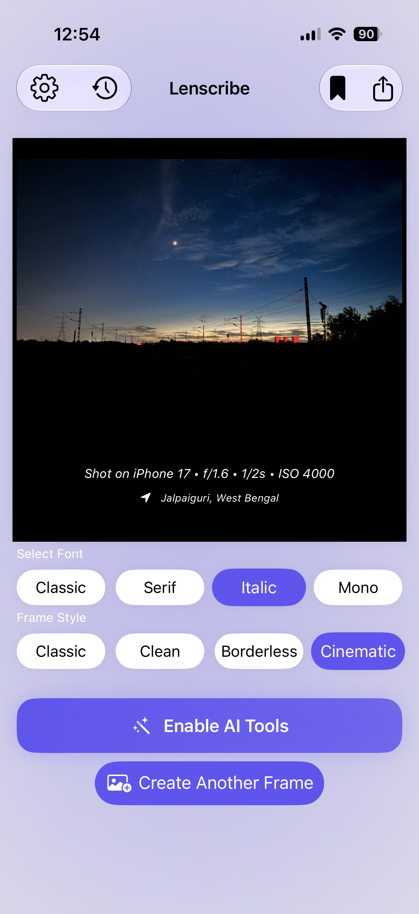

# 📸 Lenscribe

**Lenscribe** is a native iOS application built with **SwiftUI** that combines powerful AI image analysis with intuitive photo editing tools.
Capture a photo or choose one from your photo library, enhance it with built-in editing controls, and analyse it using AI—all in one seamless experience.
Unlike many AI demo apps, **Lenscribe doesn't require you to hardcode an API key**. Simply enter your own API key within the app and start using it immediately.

## ✨ Features

### 🤖 AI Image Analysis
- Analyse images using AI
- Receive detailed AI-generated responses
- Fast and responsive networking
- Configure your own API key directly inside the app

### 🖼️ Image Editing
- Adjust **Exposure**
- Adjust **Saturation**
- Apply beautiful **Presets**
- Access the editor by **pressing and holding an image**
- Preview edits instantly before analysis

### 📱 General
- Capture photos using the camera
- Import images from the Photo Library
- Built entirely with SwiftUI
- Clean, modern, and native iOS interface

## 📱 Screenshots

## 📸 Create Frame

<p align="center">
  
  
  
  
</p>

Create beautiful photo frames with customizable fonts and styles before generating AI-powered captions.
## 🚀 Getting Started

### Requirements

- Xcode 16 or later
- iOS 18 or later
- A valid AI API key

### Installation

1. Clone this repository.

```bash
git clone https://github.com/yourusername/Lenscribe.git
```

2. Open the project in Xcode.

3. Build and run the application.

4. Open **Settings** inside the app.

5. Enter your AI API key.

6. Start editing and analysing your images.

## 🔐 API Key Configuration

Lenscribe never ships with an API key.

Instead, each user can securely enter their own API key from within the application. This keeps sensitive credentials out of the source code and allows anyone to run the project without modifying it.

## 🛠 Tech Stack

- Swift
- SwiftUI
- URLSession
- REST APIs
- Codable
- Async/Await
- PhotosPicker
- Core Image

## 🎨 Image Editing

Press and hold any selected image to open the built-in editor, where you can:

- Adjust exposure
- Change saturation
- Apply photo presets
- Preview changes in real time

Once you're satisfied, send the edited image to the AI for analysis.

## 💡 Why I Built Lenscribe

Lenscribe was created to explore modern iOS development by combining AI integration with native photo editing. The project demonstrates SwiftUI, asynchronous networking, image processing, and thoughtful user experience design in a real-world application.

## 🚧 Future Improvements

- Support multiple AI providers
- Conversation history
- OCR (Text Recognition)
- Export and share AI responses
- iPad layout optimisation
- Additional editing tools (brightness, contrast, temperature, etc.)

## 🤝 Contributing

Contributions, suggestions, and bug reports are welcome. Feel free to open an issue or submit a pull request.

## 📄 License

This project is licensed under the MIT License. See the `LICENSE` file for details.
